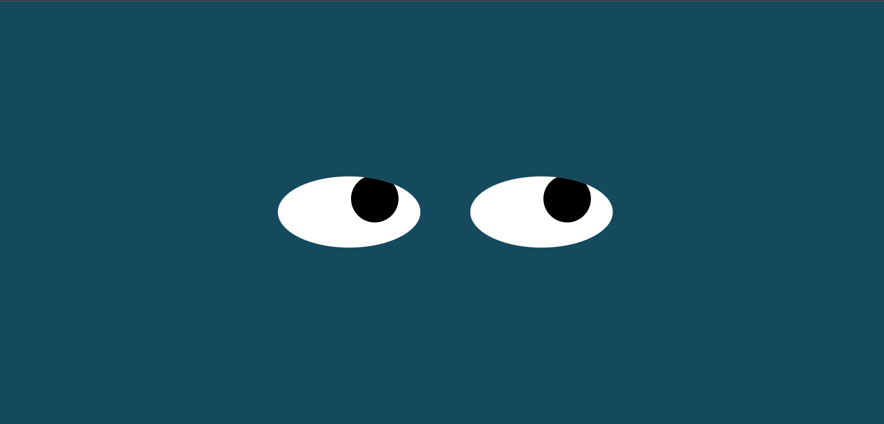

# Eye_Exercise

## Description:
  
  This program consists of javascript, html, and img files.
  The eyes follow the mouse movement.

## Installation:
  1. Downloads each file into one file.  
    1. **style.css**  
    2. **index.html**  
    3. **eyes.js**  
  2. Click **index.html** and run on the Web browser.
  
## Usage:
[Live app](https://kojiroasano.github.io/Eye_Exercise/)
  
If successfully installed and run on the Web browser, the eyes appear on center of the browser screen, and the eyes follow the cursor movement.

  
## Support:
  If any question, message me via **[my twitter](https://twitter.com/Kojiro38895598)**.
  
## Roadmap:
  The update is not expected.
  
## License information: 
 If you use the part of this code in your program and show it to public, please include the name of ***MIT***.
